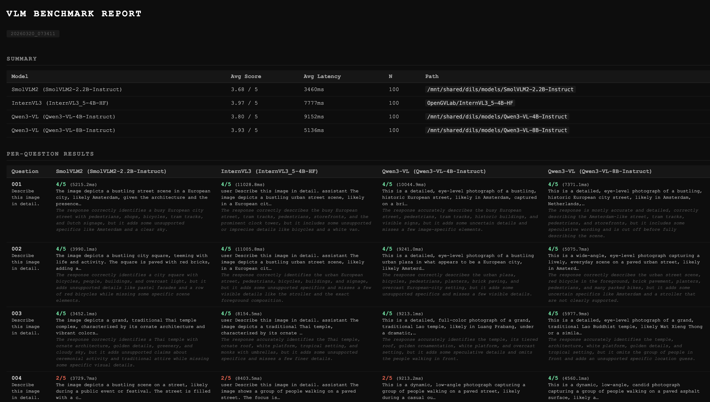

# Unified VLM Eval Framework

A modular benchmarking and experimentation framework for vision-language models (VLMs), built around a set of meeting-room and people-analysis use cases. Models run locally on GPU; evaluation pipelines cover VQA, free-form captioning, structured environment monitoring, people detection, face detection, and prompting technique comparison.

---

## Architecture Overview

```
unified_eval_framework/
│
├── benchmark/                  ← All benchmark entry points and evaluation logic
│   ├── Core benchmarks
│   │   ├── run_benchmark_vqa.py          VQA:  GPT generates Qs, GPT judges answers
│   │   ├── run_benchmark.py              Captioning: GPT judges free-form descriptions
│   │   └── run_benchmark_meeting_room.py Meeting room checklist vs ground truth (no API)
│   │
│   ├── Environment monitoring
│   │   ├── run_benchmark_env_monitoring.py          Two-stage presence + readiness
│   │   ├── run_benchmark_env_monitoring_binary.py   Binary clean/messy variant
│   │   └── run_benchmark_env_monitoring_fewshot.py  Few-shot variant
│   │
│   ├── People & face detection
│   │   ├── run_benchmark_people_detection.py  YOLO / MobileNet mAP benchmark
│   │   ├── run_pipeline_people_analysis.py    CV detection → VLM analysis pipeline
│   │   ├── run_approach_a_vlm_only.py         VLM-only (no CV pre-processing)
│   │   └── run_face_detection.py              MTCNN / RetinaFace / YOLOv8-Face
│   │
│   └── Prompting research
│       └── run_benchmark_prompting_techniques.py  Direct / CoT / few-shot comparison
│
├── finetune/                   ← LoRA fine-tuning for Qwen3-VL
├── quantize/                   ← int8 quantization (bitsandbytes, save-to-disk)
├── demo/                       ← Desktop GUI (tkinter + llama.cpp Docker)
├── inferences/                 ← Standalone single-image smoke tests
└── docs/                       ← Documentation and example output images
```

---

## Results

### VQA Benchmark — GPT-Generated Questions

GPT generates 5 targeted questions per image with reference answers. All models answer the same questions and are scored 0–100 against GPT's reference. GPT itself is scored as the theoretical ceiling.

| Model | Params | dtype | Avg Score | vs GPT | Avg Latency | N |
|-------|--------|-------|-----------|--------|-------------|---|
| GPT Baseline (gpt-4o-mini) | — | — | 90.9 / 100 | baseline | 1064 ms | 100 |
| Qwen3-VL-4B-Instruct | 4B | bfloat16 | 88.6 / 100 | −2.3 | 2547 ms | 100 |
| Qwen3-VL-8B-Instruct | 8B | bfloat16 | 88.3 / 100 | −2.6 | 3267 ms | 100 |
| Qwen3-VL-4B-Instruct | 4B | int8 | 87.5 / 100 | −3.5 | 10843 ms | 100 |
| Qwen3-VL-8B-Instruct | 8B | int8 | 87.4 / 100 | −3.5 | 13460 ms | 100 |
| SmolVLM2-2.2B-Instruct | 2.2B | bfloat16 | 72.0 / 100 | −18.9 | 315 ms | 100 |
| InternVL3-4B | 4B | bfloat16 | 65.3 / 100 | −25.6 | 1400 ms | 100 |
| InternVL3-4B | 4B | int8 | 62.9 / 100 | −28.0 | 5415 ms | 100 |

**Key findings:**
- Qwen3-VL (4B and 8B) scores within 2–3 points of the GPT ceiling — best instruction-following at this size class
- InternVL3 underperforms on VQA despite competitive captioning — captioning scores are a poor proxy for task performance
- int8 Qwen3-VL loses only ~1 point vs bfloat16 — quantization barely hurts quality
- SmolVLM2 is 4–10× faster than all other models at 315 ms with competitive quality for its size
- int8 models are slower on GPU in this setup — bitsandbytes dequantizes during inference; use GGUF int4 via llama.cpp for real speedups



---

## Quick Start

Replace `<yourname>` with your username throughout.

```bash
# 1. Clone
git clone https://github.com/axel-slid/unified_eval_framework.git
cd unified_eval_framework

# 2. Shared server — redirect caches away from home-dir quota
export HF_HOME=/mnt/shared/<yourname>/hf_cache
export HUGGINGFACE_HUB_CACHE=/mnt/shared/<yourname>/hf_cache
echo 'export HF_HOME=/mnt/shared/<yourname>/hf_cache' >> ~/.bashrc
mkdir -p /mnt/shared/<yourname>/envs /mnt/shared/<yourname>/conda_pkgs
conda config --add envs_dirs /mnt/shared/<yourname>/envs
conda config --add pkgs_dirs /mnt/shared/<yourname>/conda_pkgs

# 3. Download models (~41 GB total)
bash scripts/download_smolvlm.sh          # SmolVLM2-2.2B   (~5 GB)
bash scripts/download_internv3.sh         # InternVL3-4B    (~9 GB)
bash scripts/download_qwen3vl_4b.sh       # Qwen3-VL-4B     (~9 GB)
bash scripts/download_qwen3vl_8b.sh       # Qwen3-VL-8B     (~18 GB)

# 4. Update model_path entries in benchmark/benchmark_config.yaml

# 5. Download 100 diverse test images
cd benchmark
conda activate /mnt/shared/<yourname>/envs/Qwen3VL-env
python test_sets/download_test_images.py --count 100

# 6. Run VQA benchmark (all models + GPT baseline)
mkdir -p logs
nohup bash -c '
  export OPENAI_API_KEY=sk-...
  export HF_HOME=/mnt/shared/<yourname>/hf_cache
  export PYTORCH_ALLOC_CONF=expandable_segments:True
  cd /path/to/unified_eval_framework/benchmark
  CUDA_VISIBLE_DEVICES=0 python run_benchmark_vqa.py \
      --test-set test_sets/captioning_100.json --all
' >> logs/vqa_run.log 2>&1 &

tail -f logs/vqa_run.log
```

Results are saved to `benchmark/results/vqa_report_<timestamp>.html` — open in any browser.

---

## Repo Structure

```
unified_eval_framework/
├── scripts/
│   ├── download_smolvlm.sh           conda env + SmolVLM2 download
│   ├── download_internv3.sh          conda env + InternVL3 download
│   ├── download_qwen3vl_4b.sh        conda env + Qwen3-VL-4B download
│   ├── download_qwen3vl_8b.sh        conda env + Qwen3-VL-8B download
│   └── infer.sh                      one-off inference helper
│
├── inferences/                       standalone single-image smoke tests
│   ├── SmolVLM2-2.2B-Base.py
│   ├── InternV3_5-4B.py
│   ├── Qwen3VL-4B.py
│   └── Qwen3VL-8B.py
│
├── benchmark/
│   ├── benchmark_config.yaml         all model/judge/run settings (edit paths here)
│   ├── config.py                     loads + validates YAML into dataclasses
│   ├── judge.py                      LLM-as-judge scorer (OpenAI API, 0–100)
│   │
│   ├── Core benchmarks
│   │   ├── run_benchmark_vqa.py              VQA with GPT-generated questions
│   │   ├── run_benchmark.py                  free-form captioning
│   │   └── run_benchmark_meeting_room.py     structured checklist (no API)
│   │
│   ├── Environment monitoring benchmarks
│   │   ├── run_benchmark_env_monitoring.py          two-stage: presence → readiness
│   │   ├── run_benchmark_env_monitoring_binary.py   binary clean/messy
│   │   └── run_benchmark_env_monitoring_fewshot.py  few-shot variant
│   │
│   ├── People & face detection
│   │   ├── run_benchmark_people_detection.py  CV model mAP on COCO128
│   │   ├── run_pipeline_people_analysis.py    CV → VLM two-stage pipeline
│   │   ├── run_approach_a_vlm_only.py         VLM-only baseline (no CV)
│   │   └── run_face_detection.py              face detection model comparison
│   │
│   ├── Prompting research
│   │   └── run_benchmark_prompting_techniques.py  4 strategies: direct/CoT/few-shot
│   │
│   ├── Shell runners
│   │   ├── run_all_models.sh
│   │   ├── run_all_models_prompting.sh
│   │   ├── run_pipeline_all_vlms.sh
│   │   └── run_env_monitoring_binary.sh
│   │
│   ├── Report generators
│   │   ├── generate_plot.py
│   │   ├── generate_dashboard.py
│   │   ├── generate_binary_report.py / generate_binary_figures.py
│   │   ├── generate_pipeline_report.py / generate_pipeline_figures.py
│   │   ├── generate_prompting_report.py / generate_prompting_examples.py
│   │   ├── generate_detection_plot.py / generate_detection_figures.py
│   │   ├── generate_approach_comparison.py / generate_approach_comparison_plot.py
│   │   ├── generate_three_approach_plot.py
│   │   ├── generate_cv_comparison_plot.py
│   │   └── generate_examples_report.py
│   │
│   ├── models/
│   │   ├── __init__.py           MODEL_REGISTRY (class name → class)
│   │   ├── base.py               BaseVLMModel interface + dataclasses
│   │   ├── smolvlm.py            SmolVLM2 runner
│   │   ├── internvl.py           InternVL3 runner
│   │   ├── qwen3vl.py            Qwen3-VL runner (4B + 8B, fp + int8)
│   │   ├── yolov11.py            YOLOv11n/s person detector
│   │   ├── mobilenet_ssd.py      MobileNet SSD person detector
│   │   ├── yolov8_face.py        YOLOv8-Face face detector
│   │   ├── mtcnn_face.py         MTCNN face detector
│   │   └── retinaface.py         RetinaFace face detector
│   │
│   ├── face_detection/
│   │   ├── run.py                single-model face detection benchmark
│   │   ├── run_pipeline.py       multi-stage face detection pipeline
│   │   ├── plot.py               result plotting
│   │   ├── plot_pipeline.py      pipeline visualization
│   │   └── plot_logitech.py      Logitech-specific plot styling
│   │
│   ├── test_sets/
│   │   ├── sample.json               3-image smoke test
│   │   ├── captioning_100.json       100-image diverse test set
│   │   ├── meeting_room_sample.json  meeting room readiness samples
│   │   ├── download_test_images.py   download from Wikimedia Commons
│   │   └── generate_test_set.py      build a test set from a local folder
│   │
│   └── results/                  auto-created; JSON + HTML reports (gitignored)
│
├── quantize/
│   ├── quantize.py               quantize models to int8 and save to disk
│   └── README.md
│
├── finetune/
│   ├── train_qwen3vl_lora.py     LoRA fine-tune Qwen3-VL-4B for bbox detection
│   ├── prepare_dataset.py        download COCO + filter for person/office scenes
│   ├── eval_finetuned.py         evaluate a checkpoint on the validation split
│   ├── compare_single.py         side-by-side base vs fine-tuned on one image
│   ├── visualize_predictions.py  visualize predicted bboxes on a batch
│   ├── visualize_5.py            5-way checkpoint progression visualization
│   ├── generate_sample_grid.py   sample grid HTML/PNG for reporting
│   ├── viz_output/               representative output images (committed)
│   │   ├── comparison.png        base vs fine-tuned side-by-side
│   │   ├── finetune_sample_grid.png  sample predictions grid
│   │   └── 5way/                 5-checkpoint progression comparisons
│   └── README.md
│
├── demo/
│   ├── app.py                    desktop GUI (tkinter + llama.cpp Docker)
│   ├── prepare_ggufs.py          download/convert GGUF models from HuggingFace
│   ├── generate_vqa_demos.py     generate VQA demo scenarios
│   ├── models.json               GGUF model registry for the demo
│   └── requirements.txt          demo dependencies
│
├── docs/
│   ├── report_preview.png        example HTML report screenshot
│   └── benchmark_flowchart.md    Mermaid pipeline diagram
│
└── models/                       downloaded model weights (gitignored, ~41 GB)
```

---

## Benchmarks in Detail

### Core Benchmarks

#### VQA Benchmark (`run_benchmark_vqa.py`)
GPT generates 5 targeted, image-specific questions per image together with reference answers. Every VLM answers the same questions. GPT-as-judge scores each answer 0–100 against the reference. GPT itself is run as a theoretical ceiling baseline.

```bash
cd benchmark
CUDA_VISIBLE_DEVICES=0 python run_benchmark_vqa.py \
    --test-set test_sets/captioning_100.json --all
```

Outputs: `results/vqa_report_<timestamp>.html` + `results/vqa_results_<timestamp>.json`

#### Captioning Benchmark (`run_benchmark.py`)
VLMs describe each image freely. GPT judges each description 0–100 using a rubric that considers accuracy, completeness, and relevance.

```bash
python run_benchmark.py --test-set test_sets/captioning_100.json --models smolvlm qwen3vl_4b
```

#### Meeting Room Checklist (`run_benchmark_meeting_room.py`)
No API required. VLMs answer a fixed binary checklist per image (e.g., "Is the whiteboard clean?", "Are chairs arranged?"). Predictions are compared to human ground-truth labels. Metrics: item accuracy, room accuracy, per-item F1.

```bash
python run_benchmark_meeting_room.py --test-set test_sets/meeting_room_sample.json --all
```

---

### Environment Monitoring (`run_benchmark_env_monitoring.py`)

Two-stage pipeline for meeting-room readiness assessment:

1. **Stage 1 — Presence**: "Is there a [whiteboard / blinds / chairs / table] in this image?" → yes / no
2. **Stage 2 — Readiness** (only if present): "Is the [X] ready for a meeting?" → ready / not_ready

This yields four predicted classes:

| Class | Meaning |
|-------|---------|
| `not_present` | Stage 1 returned no |
| `present_clean` | Stage 1 yes, Stage 2 ready |
| `present_messy` | Stage 1 yes, Stage 2 not_ready |
| `uncertain` | Stage 1 yes, Stage 2 unparseable |

```bash
python run_benchmark_env_monitoring.py --all
python run_benchmark_env_monitoring.py --models qwen3vl_4b internvl
```

Variants:
- `run_benchmark_env_monitoring_binary.py` — skips Stage 1, classifies directly as clean/messy
- `run_benchmark_env_monitoring_fewshot.py` — injects reference example images into the prompt

---

### People Detection Pipeline (`run_pipeline_people_analysis.py`)

Two-stage hybrid pipeline for meeting participant analysis:

**Stage 1 — CV detection** (YOLOv11n, YOLOv11s, MobileNet SSD): Detect persons and extract bounding-box crops.

**Stage 2 — VLM analysis**: Each detected person is analysed by passing both the full room image and the person crop to the VLM, enabling spatial context (position at table, posture) plus close-up detail. Questions asked per person:
- Is this person a meeting participant?
- Is this person currently talking/speaking?

```bash
python run_pipeline_people_analysis.py
python run_pipeline_people_analysis.py --vlm smolvlm qwen3vl_4b
python run_pipeline_people_analysis.py --detector-for-crops yolo11s
```

#### CV-Only People Detection (`run_benchmark_people_detection.py`)
Benchmarks YOLOv11n, YOLOv11s, and MobileNet SSD for person detection on COCO128, reporting mAP@50, mAP@75, and latency.

#### VLM-Only Baseline (`run_approach_a_vlm_only.py`)
Approach A: single VLM call per image for simultaneous person detection + role classification, no CV pre-processing. Useful as an upper-bound simplicity baseline.

---

### Face Detection (`run_face_detection.py`)

Benchmarks three face detectors on a custom people-images dataset:

| Model | Backend |
|-------|---------|
| MTCNN | facenet-pytorch |
| RetinaFace | insightface / ONNX Runtime |
| YOLOv8-Face | ultralytics, fine-tuned on WiderFace |

```bash
python run_face_detection.py
```

See `benchmark/face_detection/` for pipeline variants and Logitech-device-specific plots.

---

### Prompting Techniques (`run_benchmark_prompting_techniques.py`)

Compares four prompting strategies on the meeting-room checklist task:

| Technique | Description |
|-----------|-------------|
| **Direct** | One model call per checklist item: "Is [condition] true? Answer Yes or No." |
| **Chain-of-Thought** | Single call; model reasons step-by-step then outputs the full checklist. |
| **Few-Shot Batch** | Single call with two reference images (READY + NOT READY) prepended. |
| **Few-Shot Per-Item** | One call per item with reference images showing true/false examples. |

```bash
python run_benchmark_prompting_techniques.py --all
```

---

## Configuration (`benchmark_config.yaml`)

Single source of truth for all model paths, generation settings, and judge configuration.

```yaml
output_dir: results/

judge:
  model: gpt-4o-mini      # OpenAI model used for scoring
  max_tokens: 256
  timeout_seconds: 30

generation_defaults:
  max_new_tokens: 256
  do_sample: false

models:
  smolvlm:
    enabled: true
    class: SmolVLMModel
    model_path: /mnt/shared/<yourname>/models/SmolVLM2-2.2B-Instruct
    dtype: bfloat16

  internvl:
    enabled: true
    class: InternVLModel
    model_path: /mnt/shared/<yourname>/models/InternVL3_5-4B-HF
    dtype: bfloat16

  qwen3vl_4b:
    enabled: true
    class: Qwen3VLModel
    model_path: /mnt/shared/<yourname>/models/Qwen3-VL-4B-Instruct
    dtype: bfloat16

  qwen3vl_8b:
    enabled: true
    class: Qwen3VLModel
    model_path: /mnt/shared/<yourname>/models/Qwen3-VL-8B-Instruct
    dtype: bfloat16

  # int8 variants — enable after running quantize/quantize.py
  internvl_int8:
    enabled: false
    class: InternVLModel
    model_path: /mnt/shared/<yourname>/models/InternVL3_5-4B-HF-int8
    dtype: bfloat16   # weights are already int8 on disk

  qwen3vl_4b_int8:
    enabled: false
    class: Qwen3VLModel
    model_path: /mnt/shared/<yourname>/models/Qwen3-VL-4B-Instruct-int8
    dtype: bfloat16

  qwen3vl_8b_int8:
    enabled: false
    class: Qwen3VLModel
    model_path: /mnt/shared/<yourname>/models/Qwen3-VL-8B-Instruct-int8
    dtype: bfloat16
```

Use `enabled: false` to skip a model without removing its config.

---

## Step-by-Step Onboarding

### Step 1 — Download models

```bash
bash scripts/download_smolvlm.sh
bash scripts/download_internv3.sh
bash scripts/download_qwen3vl_4b.sh
bash scripts/download_qwen3vl_8b.sh
```

Each script creates a dedicated conda environment and downloads the model.

| Model | Conda Env | Disk |
|-------|-----------|------|
| SmolVLM2-2.2B-Instruct | `SmolVLM-env` | ~5 GB |
| InternVL3-4B | `InternV3-env` | ~9 GB |
| Qwen3-VL-4B-Instruct | `Qwen3VL-env` | ~9 GB |
| Qwen3-VL-8B-Instruct | `Qwen3VL-env` | ~18 GB |

> Qwen3-VL env is created on shared disk to avoid home-dir quota issues.
> Activate with full path: `conda activate /mnt/shared/<yourname>/envs/Qwen3VL-env`

---

### Step 2 — Verify inference

Smoke-test each model with a single image before running the full benchmark.

```bash
conda activate SmolVLM-env
python inferences/SmolVLM2-2.2B-Base.py

conda activate InternV3-env
python inferences/InternV3_5-4B.py

conda activate /mnt/shared/<yourname>/envs/Qwen3VL-env
python inferences/Qwen3VL-4B.py
python inferences/Qwen3VL-8B.py    # needs 16 GB+ VRAM
```

---

### Step 3 — Configure `benchmark_config.yaml`

Update `model_path` for each model to your local download location. See the full config example above.

---

### Step 4 — Prepare a test set

**Option A — Download 100 diverse images (recommended)**

```bash
cd benchmark
python test_sets/download_test_images.py --count 100
# generates test_sets/captioning_100.json automatically
```

Images are sourced from Wikimedia Commons across 10 categories. No API key needed.

```bash
# throttle if you hit rate limits
python test_sets/download_test_images.py --count 100 --delay 2.0

# single topic
python test_sets/download_test_images.py --count 100 --query "office meeting room"
```

**Option B — Built-in 3-image smoke test**

`benchmark/test_sets/sample.json` — use first to verify the pipeline end-to-end.

**Option C — Your own images**

```bash
python test_sets/generate_test_set.py \
    --images /path/to/your/images \
    --output test_sets/your_test_set.json
```

---

### Step 5 — (Optional) Quantize to int8

```bash
cd quantize
conda activate /mnt/shared/<yourname>/envs/Qwen3VL-env
pip install bitsandbytes optimum

python quantize.py --all       # all supported models
python quantize.py --list      # show available models and status
```

See `quantize/README.md` for details. Quantized models load like normal local models — no re-quantizing on each run.

---

### Step 6 — Run benchmarks

```bash
cd benchmark
export OPENAI_API_KEY=sk-...
conda activate /mnt/shared/<yourname>/envs/Qwen3VL-env

# VQA (GPT-generated questions, all models)
CUDA_VISIBLE_DEVICES=0 python run_benchmark_vqa.py \
    --test-set test_sets/captioning_100.json --all

# Captioning
CUDA_VISIBLE_DEVICES=0 python run_benchmark.py \
    --test-set test_sets/captioning_100.json --all

# Environment monitoring (no API key needed)
CUDA_VISIBLE_DEVICES=0 python run_benchmark_env_monitoring.py --all

# People detection pipeline
CUDA_VISIBLE_DEVICES=0 python run_pipeline_people_analysis.py

# Prompting technique comparison
CUDA_VISIBLE_DEVICES=0 python run_benchmark_prompting_techniques.py --all
```

---

### Step 7 — Open reports

All reports are saved to `benchmark/results/`. Open the HTML files in any browser:

```bash
# Example
open benchmark/results/vqa_report_<timestamp>.html
```

---

## Adding a New VLM — 3 Steps

**1. Create `benchmark/models/yourmodel.py`**
```python
from models.base import BaseVLMModel, InferenceResult
from config import ModelConfig

class YourModel(BaseVLMModel):
    def __init__(self, cfg: ModelConfig):
        self.cfg = cfg
        self.name = "YourModel"

    def load(self): ...
    def run(self, image_path: str, question: str) -> InferenceResult: ...
    def unload(self): ...  # optional — called between model runs
```

**2. Register in `benchmark/models/__init__.py`**
```python
from .yourmodel import YourModel

MODEL_REGISTRY = {
    ...
    "YourModel": YourModel,
}
```

**3. Add to `benchmark/benchmark_config.yaml`**
```yaml
models:
  yourmodel:
    enabled: true
    class: YourModel
    model_path: org/repo-or-local-path
    dtype: bfloat16
    generation:
      max_new_tokens: 256
```

No changes to any benchmark runner needed.

---

## Fine-Tuning

See `finetune/README.md` for the full LoRA fine-tuning pipeline for Qwen3-VL-4B on person bounding-box detection.

## Quantization

See `quantize/README.md` for int8 quantization workflow and memory savings.

## Demo

See `demo/` for the desktop GUI application that runs GGUF models via llama.cpp Docker containers on CPU, with a tkinter interface for uploading images and comparing model outputs side-by-side.
