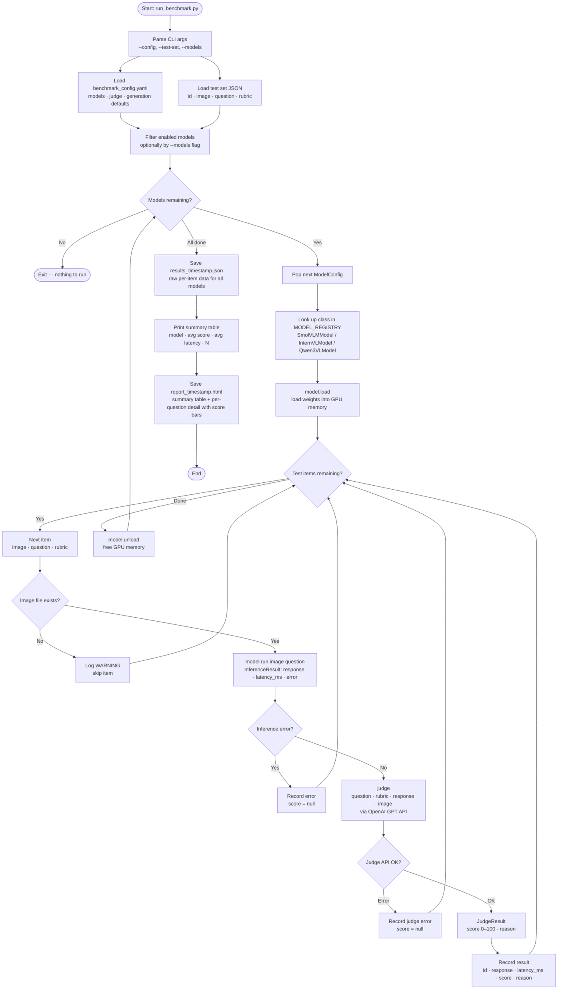

# Benchmark Pipeline Flowchart

## Key Components

| Component | File | Role |
|---|---|---|
| Entry point | `run_benchmark.py` | Orchestrates the full pipeline |
| Config | `benchmark_config.yaml` | Models, judge settings, generation params |
| Test set | `test_sets/sample.json` | List of `{id, image, question, rubric}` items |
| Model base | `models/base.py` | Abstract `BaseVLMModel` — `load()`, `run()`, `unload()` |
| Models | `models/{smolvlm,internvl,qwen3vl}.py` | Concrete VLM runners |
| Registry | `models/__init__.py` | Maps YAML `class:` string → Python class |
| Judge | `judge.py` | Calls OpenAI GPT to score responses 0–100 |
| Config parser | `config.py` | Parses YAML into typed dataclasses |

## Score Scale (Judge)

| Range | Meaning |
|---|---|
| 0–20 | Completely wrong / hallucination / refusal |
| 21–40 | Mostly wrong, minor correct elements |
| 41–60 | Partially correct, missing key details |
| 61–80 | Mostly correct, minor issues |
| 81–100 | Fully correct and complete |
