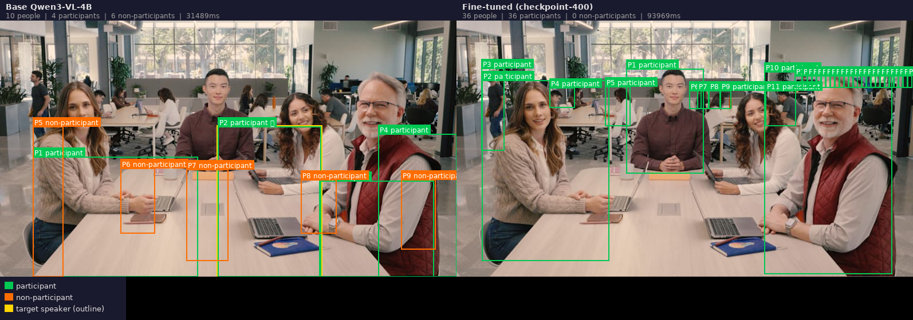
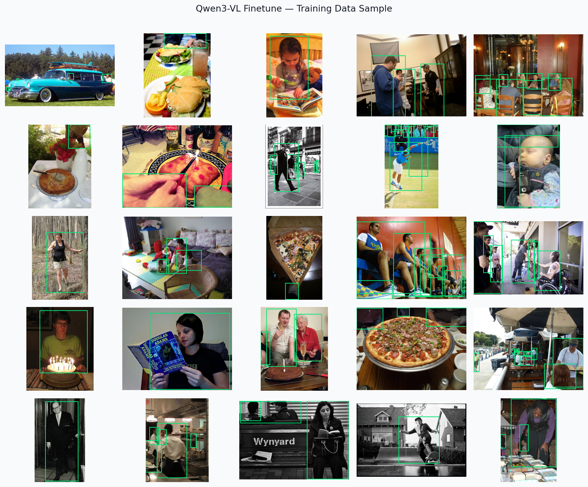

# Fine-Tuning

LoRA fine-tuning of Qwen3-VL-4B for person bounding-box detection in meeting-room images.

The vision encoder is frozen. LoRA adapters are applied to the language model layers only. Training uses causal language modelling loss on the full sequence (prompt + response).

---

## Directory Structure

```
finetune/
├── train_qwen3vl_lora.py     main training script (single-GPU + multi-GPU via accelerate)
├── prepare_dataset.py        download COCO 2017 + filter for person / office scenes
├── eval_finetuned.py         evaluate a checkpoint on the validation split
├── compare_single.py         side-by-side base vs fine-tuned on one image
├── visualize_predictions.py  visualize predicted bboxes on a batch of images
├── visualize_5.py            5-checkpoint progression visualization
├── generate_sample_grid.py   produce a sample-grid HTML/PNG for reporting
├── setup.sh                  install dependencies
├── data/                     training data (jsonl files; images gitignored)
│   ├── meeting_train.jsonl
│   └── stage2_train.jsonl
├── checkpoints/              training checkpoints (gitignored)
│   └── qwen3vl_bbox_lora/
│       ├── checkpoint-100/ ... checkpoint-1614/
│       └── final/            final adapter weights + tokenizer + processor
└── viz_output/               representative output images (committed)
    ├── comparison.png          base vs fine-tuned side-by-side
    ├── finetune_sample_grid.png  batch prediction grid
    └── 5way/                  5-checkpoint progression comparisons
        ├── comparison_1.png
        ├── comparison_2.png
        ├── comparison_3.png
        ├── comparison_4.png
        └── comparison_5.png
```

---

## Setup

```bash
cd finetune
bash setup.sh
# or manually:
conda activate /mnt/shared/<yourname>/envs/Qwen3VL-env
pip install peft accelerate bitsandbytes trl
```

---

## Dataset Preparation

Downloads COCO 2017 train split and filters for images containing people in office/meeting-room scenes. Generates instruction-tuning data in the format expected by the training script.

```bash
python prepare_dataset.py
```

Outputs:
- `data/coco_train.jsonl` — 90% training split
- `data/coco_val.jsonl` — 10% validation split

Each record contains an image path, a prompt asking for person bounding boxes, and the expected JSON response.

```jsonl
{"image": "data/images/000012.jpg", "question": "Detect all people in this image. Return a JSON list of bounding boxes in [x1, y1, x2, y2] format.", "answer": "[{\"bbox\": [45, 120, 310, 480]}]"}
```

---

## Training

### Single GPU

```bash
conda activate /mnt/shared/<yourname>/envs/Qwen3VL-env
python train_qwen3vl_lora.py
```

### Multi-GPU (recommended)

```bash
accelerate launch --num_processes 2 train_qwen3vl_lora.py
```

### Key hyperparameters (edit in script)

| Parameter | Default | Description |
|-----------|---------|-------------|
| `LORA_R` | 16 | LoRA rank |
| `LORA_ALPHA` | 32 | LoRA alpha |
| `LORA_DROPOUT` | 0.05 | Dropout on LoRA layers |
| `LR` | 2e-4 | Learning rate |
| `BATCH_SIZE` | 2 | Per-device batch size |
| `GRAD_ACCUM` | 4 | Gradient accumulation steps |
| `MAX_STEPS` | 1614 | Total training steps |
| `SAVE_STEPS` | 200 | Checkpoint save interval |

Checkpoints are saved to `checkpoints/qwen3vl_bbox_lora/` every `SAVE_STEPS` steps. The final adapter is saved to `checkpoints/qwen3vl_bbox_lora/final/`.

---

## Evaluation

Evaluate a checkpoint on the validation split:

```bash
python eval_finetuned.py \
    --checkpoint checkpoints/qwen3vl_bbox_lora/final \
    --data data/coco_val.jsonl
```

Outputs per-sample predicted vs ground-truth bboxes and aggregate IoU / accuracy metrics.

---

## Visualization

### Side-by-side: base vs fine-tuned

```bash
python compare_single.py \
    --image data/images/000042.jpg \
    --checkpoint checkpoints/qwen3vl_bbox_lora/final
```

### Batch prediction grid

```bash
python visualize_predictions.py \
    --checkpoint checkpoints/qwen3vl_bbox_lora/final \
    --data data/coco_val.jsonl \
    --n 16
```

### 5-checkpoint progression

```bash
python visualize_5.py \
    --checkpoints checkpoints/qwen3vl_bbox_lora/checkpoint-200 \
                  checkpoints/qwen3vl_bbox_lora/checkpoint-600 \
                  checkpoints/qwen3vl_bbox_lora/checkpoint-1000 \
                  checkpoints/qwen3vl_bbox_lora/checkpoint-1400 \
                  checkpoints/qwen3vl_bbox_lora/final
```

### Sample grid report

```bash
python generate_sample_grid.py \
    --checkpoint checkpoints/qwen3vl_bbox_lora/final \
    --output viz_output/finetune_sample_grid.png
```

---

## Example Output

Base vs fine-tuned comparison on a meeting-room image:



Sample prediction grid (fine-tuned, final checkpoint):



---

## Using the Fine-Tuned Model

Load the final adapter on top of the base Qwen3-VL-4B model:

```python
from peft import PeftModel
from transformers import AutoProcessor, Qwen2_5_VLForConditionalGeneration

base = Qwen2_5_VLForConditionalGeneration.from_pretrained(
    "/mnt/shared/<yourname>/models/Qwen3-VL-4B-Instruct",
    torch_dtype="bfloat16",
    device_map="auto",
)
model = PeftModel.from_pretrained(base, "finetune/checkpoints/qwen3vl_bbox_lora/final")
processor = AutoProcessor.from_pretrained("finetune/checkpoints/qwen3vl_bbox_lora/final")
```
